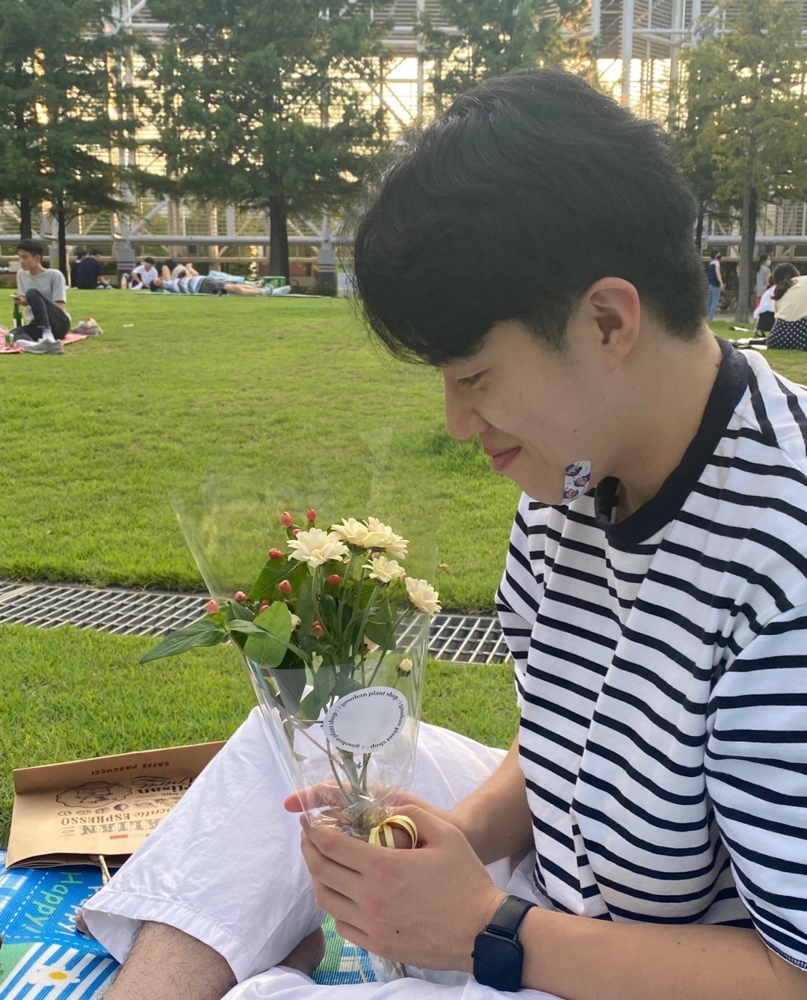

# 이지원

<!-- {: width="50%" height="50%"} -->

# Introduce.

**인턴 개발자**로 스타트업에서 웹과 앱 서비스 개발을 경험하였습니다. **반응형 웹 개발, 상태관리, 크로스 브라우징 이슈 해결** 등을 통해 회사의 홈페이지&샵 리뉴얼 작업을 담당한 경험이 있습니다. 이후 신입 개발자로서 초기 스타트업에서 **프론트엔드 리드 개발** 역할을 맡아 웹 서비스 개발/배포/운영하였습니다. **코딩컨벤션, 커밋규칙, 코드 리뷰 및 테스트**를 통해 git을 효율적으로 관리한 경험이 있습니다.

**사용자 경험**을 만족시키는 것을 최우선으로 합니다. 이를 위해 유지보수에 능한 코드 작성을 통해 반복적인 QA와 테스트를 시행하고 빠른 기획 반영을 가능하게 하였습니다. 또한 인턴 기간 중 제품 및 서비스에 대한 이해를 위해 최선을 다했고 기획자와 디자이너의 요구사항을 명확하게 파악해서 **좋은 커뮤니케이션** 평가를 얻고 협업에 대한 자신감을 항상 가지고 있습니다.

**새로운 것에 도전하는 일**을 좋아합니다. 커피/축구/프론트/백/데브옵스/데이터 분야 상관없이 흥미를 느끼게 되는 분야가 있으면 기초부터 바로 학습하는 실행력을 가지고 있습니다. “기반이 단단해야 무너지지 않는다”는 저의 개발 신념입니다.

# Skill.

- Front-End: JavaScript, TypeScript, React.js, Next.js, HTML/CSS
- Back-End: Node.js, Firebase
- DevOps: docker, Kubernetes
- Data: SQL, Google Analytics
- Collaboration & Tools: Notion, Slack, VS Code, GitKraken, Figma, Sketch

# Work Experiences.

## 스타터스

2021.03.01 ~ 2021.11.20

- Front-End 리드 개발자
  - 효과적인 협업을 위해 커밋규칙, 코드리뷰 문화 적용 및 git Hook을 통한 git 관리 시행.
  - 효율적인 서비스 노출 위해 Next.js 도입을 통한 SSR을 구현
  - 생산성을 높이기 위한 아키텍처 설계, ESLint, Prettier, Airbnb 도입을 통한 컨벤션 정립.
  - Redux를 통한 상태관리 개선

## 비햅틱스

[https://www.bhaptics.com/](https://www.bhaptics.com/)
2021.03.02 ~ 2021.08.20

- SW부서 인턴 개발자(웹, 앱)
  - 각종 페이지 UI/UX 디자인 안을 바탕으로 반응형 웹 개발
  - Redux를 이용해 상태관리 및 장바구니 기능 구현
  - 7개 다국어지원 기능 구현
  - ReactNative를 이용한 앱 서비스 뷰 개발
  - Firebase 데이터 구조화를 통해 follower 기능 구현

# Education.

## 충남대학교

2016.03 ~ 2022.02

- 컴퓨터공학 전공
